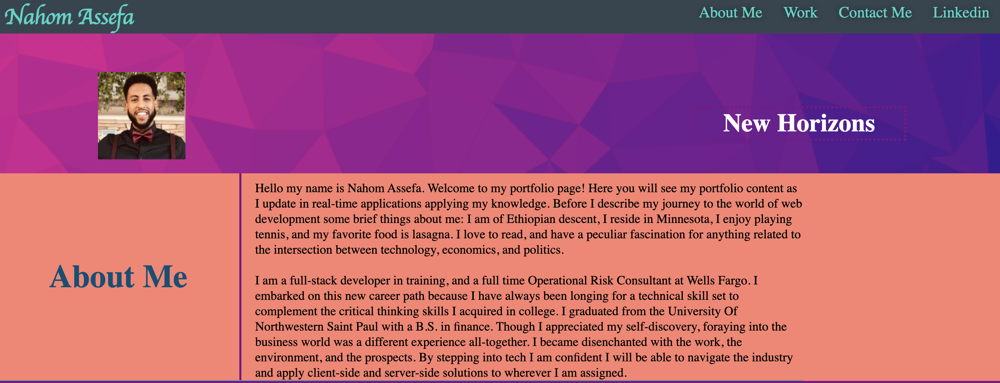

# Professional-Portfolio

**Version 1.0.0**

## The Purpose
The purpose of this project was to create a portfolio from scratch -that was malleable ostebsibly for future use- so we could showcase our work to future employers.

## Significant Changes
Took advantage of the root pseudo-class for repeat color styling. Used the mock-up as a barometer for layout, but took it upon myself to find my own color scheme. Took greater use of the id selector as this project contained more individual elements that were unique to themselves such as the containers housing all the images. More emphasis of the flexbox model was applied on this project to capitalize on viewport parameters. Applied the position styling to get the image of myself, .purp h2 subtitle, and various container subtitles within the proper context.

### Challenges 
On this particular challenge I noticed I had some trouble getting the containers to play nice within the parent element. Sizing and figuring out the appropriate proportions of use for unused space wasn't the easiest- especially considering the coupling of the h2 element specifying the content of the section. The various viewports of the .flex-container class also proved somewhat of a roadblock to my goal of having the website be fully responsive. Still working through the nuances of parent-child relationships and the relational effect on each individual element housed in a container- especially inline elements.

### Screenshot

#### Link
https://nahom-assefa.github.io/Professional-Portfolio/

##### License and Copyright 
© Xander Rapstine, Trilogy Education Services/2U